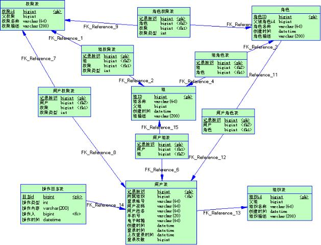

# Desgin

## 权限管理

[参考原文](https://blog.csdn.net/nwenji/article/details/8796738)
<https://blog.csdn.net/nwenji/article/details/8796738>

### 设计目标

设计一个灵活、通用、方便的权限管理系统。
在这个系统中，我们需要对痛的所有资源进行权限控制。

资源主要可以分为**静态资源**（功能操作、数据列）和**动态资源**（数据），也分别称为**对象资源**和**数据资源**，后者是我们在系统设计与实现中的叫法。

系统的目标就是对应用系统的所有对象资源和数据资源进行权限控制，比如应用系统的功能菜单、各个界面的按钮、数据显示的列以及各种行级数据进行权限的操控。

### 相关对象及其关系

大概清理了一下权限系统的相关概念，如下图所示:

#### 1、权限

系统的所有权限信息。权限具有上下级关系，是一个树状结构。如：

+ 系统管理
  + 用户管理
    + 查看用户
    + 新增用户
    + 修改用户
    + 删除用户

对于上面的每个权限，又存在两种情况，一个是只是可访问，另一种是可授权，例如对于“查看用户”这个权限，如果用户只被授予“可访问”，那么他就不能将他所具有的这个权限分配给其他人。

#### 2、用户

应用系统的具体操作者，用户可以自己拥有权限信息，可以归属于0～n个角色，可属于0～n个组。他的权限集是自身具有的权限、所属的各角色具有的权限、所属的各组具有的权限的合集。它与权限、角色、组之间的关系都是n对n的关系。

#### 3、角色

为了对许多拥有相似权限的用户进行分类管理，定义了角色的概念，例如系统管理员、管理员、用户、访客等角色。角色具有上下级关系，可以形成树状视图，父级角色的权限是自身及它的所有子角色的权限的综合。父级角色的用户、父级角色的组同理可推。

#### 4、组

为了更好地管理用户，对用户进行分组归类，简称为用户分组。组也具有上下级关系，可以形成树状视图。在实际情况中，我们知道，组也可以具有自己的角色信息、权限信息。这让我想到我们的QQ用户群，一个群可以有多个用户，一个用户也可以加入多个群。每个群具有自己的权限信息。例如查看群共享。QQ群也可以具有自己的角色信息，例如普通群、高级群等。

针对上面提出的四种类型的对象，让我们通过图来看看他们之间的关系。

有上图中可以看出，这四者的关系很复杂，而实际的情况比这个图还要复杂，权限、角色、组都具有上下级关系，权限管理是应用系统中比较棘手的问题，要设计一个通用的权限管理系统，工作量也着实不小。

当然对于有些项目，权限问题并不是那么复杂。有的只需要牵涉到权限和用户两种类型的对象，只需要给用户分配权限即可。

在另一些情况中，引入了角色对象，例如基于角色的权限系统， 只需要给角色分配权限，用户都隶属于角色，不需要单独为用户分配角色信息。

理清了对象关系之后，让我们接着来进行数据库的设计。在数据库建模时，对于N对N的关系，一般需要加入一个关联表来表示关联的两者的关系。初步估计一下，本系统至少需要十张表，分别为：权限表、用户表、角色表、组表、用户权限关联表、用户角色关联表、角色权限关联表、组权限关联表、组角色关联表、用户属组关联表。当然还可能引出一些相关的表。下面让我们在PowerDesigner中画出各表吧。

各表及其关系如下

